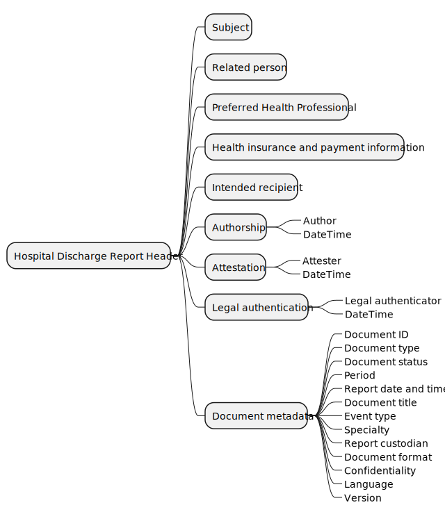
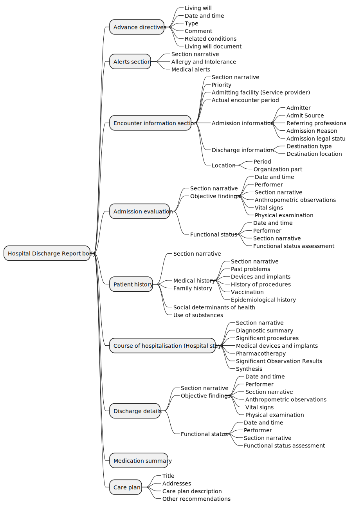

### Introduction 
Specify a set of rules that will be used for HL7 FHIR to define how to represent hospital discahrge messages in the Czech national context, in line with European eHN guidelines.

Its main objective is to define the content components and the preferred structure to be used to construct a hospital discharge report.The purpose of this standard is to define the representation of the discharge report as a patient's medical record for the purpose of electronic exchange of health information between individuals, healthcare providers and infrastructure in the Czech Republic. 

This includes both jurisdictional and cross-border scenarios.

This guide does not describe how to exchange this message.

### Information Models

Basic Sections of the Hospital Discharge Report

| Section |	Cardinality	| Obligation | Link |
| - | - | - | - |
| A.1 Header with Administrative Document Data | 1..1 |	Mandatory | [Link](ConceptMap-advanceDirectives2FHIR-cz-hdr.html) |
| A.2 Document Content | 1..1 | Mandatory | [Link](ConceptMap-advanceDirectives2FHIR-cz-hdr.html) |
| A.2.1 Previously Expressed Wishes | 0..1 | Required | [Link](ConceptMap-advanceDirectives2FHIR-cz-hdr.html) |
| A.2.2 Urgent Information | 1..1 | Mandatory | [Link](ConceptMap-advanceDirectives2FHIR-cz-hdr.html) |
| A.2.3 Hospitalization Data | 1..1 | Mandatory | [Link](ConceptMap-advanceDirectives2FHIR-cz-hdr.html) |
| A.2.4 Reason for Admission | 0..1 | Required | [Link](ConceptMap-advanceDirectives2FHIR-cz-hdr.html) |
| A.2.5 Condition at Admission (Initial Examination) | 0..1 | Optional | [Link](ConceptMap-advanceDirectives2FHIR-cz-hdr.html) |
| A.2.6 Medical History | 0..1 | Optional | [Link](ConceptMap-advanceDirectives2FHIR-cz-hdr.html) |
| A.2.7 Course of Hospitalization| 1..1| Mandatory| [Link](ConceptMap-advanceDirectives2FHIR-cz-hdr.html) |
| A.2.8 Condition at Discharge|	1..1| Mandatory | [Link](ConceptMap-advanceDirectives2FHIR-cz-hdr.html) |
| A.2.9 Recommendations| 0..1 | Required | [Link](ConceptMap-advanceDirectives2FHIR-cz-hdr.html) |

#### Conceptual view

Hospital discharge report could be divided into several parts: document header, body and optionally it could also have various attachments.

##### Hospital Discharge Report

<strong>Fig. 1: TODO Popsat</strong>

 

##### Hospital Discharge Report header

<strong>Fig. 1: TODO Popsat</strong>

 

##### Hospital Discharge Report body

<strong>Fig. 1: TODO Popsat</strong>

 

### Scope
This document presents Czech use concepts defined via FHIR processable artefacts; these are collaborative outputs with agreed approaches to varied kinds of healthcare related information based on the core FHIR R4 specification.

This guide is divided into several pages which are listed at the top of each page in the menu bar.

- [Home](index.html): This page provides the introduction and scope for this guide.
- [Artifacts](artifacts.html): These page lists detailed descriptions and formal definitions for all the Czech HDR artifacts and logic model defined in this guide.

### Dependencies



### Cross Version Analysis



### IP statements



